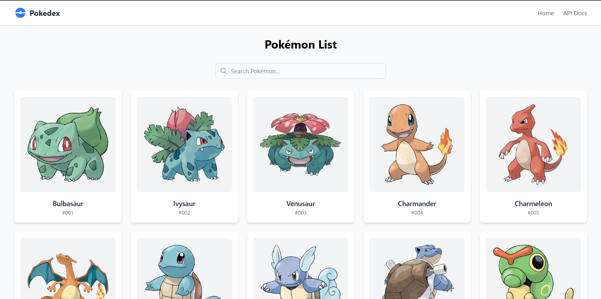
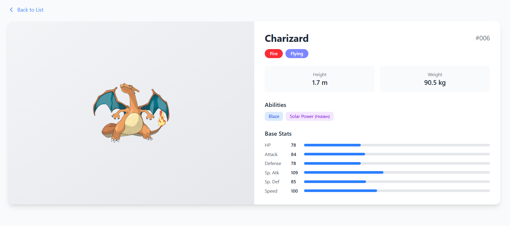

# Pokémon Explorer

A modern web application for browsing and exploring Pokémon data, built with React, TypeScript, and TailwindCSS.




## 🚀 Live Demo

**[View Live Application](https://your-deployment-url.vercel.app)**

## ✨ Features

- **Pokémon List**: Browse all Pokémon in a responsive grid layout
- **Search & Filter**: Real-time filtering of Pokémon by name
- **Detailed View**: Click on any Pokémon to see detailed information including:
  - Types with color-coded badges
  - Base stats with visual progress bars
  - Abilities (including hidden abilities)
  - Height and weight information
  - Official artwork
- **Loading States**: Elegant loading spinners for better UX
- **Error Handling**: Graceful error states with user-friendly messages
- **Responsive Design**: Works seamlessly on desktop and mobile devices

## 🛠️ Tech Stack

- **Frontend Framework**: React 19 with TypeScript
- **Build Tool**: Vite
- **Styling**: TailwindCSS
- **State Management**: React Query (@tanstack/react-query)
- **Routing**: React Router DOM
- **HTTP Client**: Axios
- **Testing**: Vitest + React Testing Library
- **API Mocking**: MSW (Mock Service Worker)
- **Data Source**: [PokéAPI](https://pokeapi.co/)

## 📋 Setup Instructions

### Prerequisites

- Node.js 18+
- npm or yarn

### Installation

1. Clone the repository:

   ```bash
   git clone https://github.com/pushpendrakukreti/pokedex.git
   cd pokedex
   ```

2. Install dependencies:

   ```bash
   npm install
   ```

3. Start the development server:

   ```bash
   npm run dev
   ```

4. Open [http://localhost:5173](http://localhost:5173) in your browser.

### Available Scripts

| Command                 | Description                    |
| ----------------------- | ------------------------------ |
| `npm run dev`           | Start development server       |
| `npm run build`         | Build for production           |
| `npm run preview`       | Preview production build       |
| `npm run test`          | Run tests in watch mode        |
| `npm run test:run`      | Run tests once                 |
| `npm run test:coverage` | Run tests with coverage report |
| `npm run lint`          | Run ESLint                     |
| `npm run lint:fix`      | Fix ESLint issues              |
| `npm run format`        | Format code with Prettier      |
| `npm run format:check`  | Check code formatting          |

## 🏗️ Architecture

### Project Structure

```
src/
├── components/
│   ├── PokemonCard/           # Individual Pokemon card component
│   │   ├── PokemonCard.tsx
│   │   ├── PokemonCard.test.tsx
│   │   └── index.ts
│   ├── PokemonDetail/         # Pokemon detail page component
│   │   ├── PokemonDetail.tsx
│   │   ├── PokemonDetail.test.tsx
│   │   └── index.ts
│   └── PokemonList/           # Pokemon list page component
│       ├── PokemonList.tsx
│       ├── PokemonList.test.tsx
│       └── index.ts
├── services/
│   ├── pokemonApi.ts          # API service layer
│   └── pokemonApi.test.ts     # API service tests
├── types/
│   └── pokemon.ts             # TypeScript interfaces
├── utils/
│   ├── helper.ts              # Reusable functions & constants
│   └── helper.test.ts         # Helper function tests
├── test/
│   ├── mocks/                 # MSW mock handlers
│   │   ├── handlers.ts
│   │   └── server.ts
│   ├── setup.ts               # Test setup configuration
│   └── App.integration.test.tsx
├── App.tsx                    # Main application component
├── main.tsx                   # Application entry point
└── index.css                  # Global styles with Tailwind
```

### Key Architectural Decisions

1. **React Query for Data Fetching**:
   - Provides built-in caching, refetching, and loading state management
   - Reduces boilerplate compared to manual state management
   - Improves performance with background refetching

2. **Component-Based Architecture**:
   - Each component is self-contained with its own tests
   - Separation of concerns between presentation and data fetching
   - Easy to maintain and test individually

3. **TypeScript for Type Safety**:
   - Strong typing for API responses
   - Better developer experience with autocompletion
   - Catches errors at compile time

4. **TailwindCSS for Styling**:
   - Utility-first approach for rapid development
   - Consistent design system
   - Small bundle size with PurgeCSS

5. **MSW for API Mocking**:
   - Tests run against mock handlers
   - Realistic testing without network calls
   - Same handlers can be used for development

## 🧪 Testing Strategy

### TDD Workflow

This project follows **Test-Driven Development (TDD)**:

1. **Red**: Write failing tests first
2. **Green**: Implement minimal code to pass tests
3. **Refactor**: Improve code while keeping tests green

### Test Types

- **Unit Tests**: Test individual components in isolation
- **Integration Tests**: Test navigation and user flows

### Running Tests

```bash
# Run all tests
npm run test:run

# Run with coverage
npm run test:coverage

# Watch mode for development
npm run test
```

### Test Coverage

The project maintains **96%+ test coverage** with 64 tests across 6 test files:

| Test File                | Tests |
| ------------------------ | ----- |
| PokemonCard.test.tsx     | 8     |
| PokemonDetail.test.tsx   | 9     |
| PokemonList.test.tsx     | 8     |
| pokemonApi.test.ts       | 12    |
| helper.test.ts           | 23    |
| App.integration.test.tsx | 4     |

Coverage includes:

- Component rendering and styling
- User interactions (filtering, navigation)
- Loading and error states
- API integration
- Helper functions and constants

## 🔄 CI/CD

### GitHub Actions Pipeline

The project includes a CI/CD pipeline that runs on every push and pull request:

1. **Linting**: Checks code quality with ESLint
2. **Format Check**: Validates code formatting with Prettier
3. **Testing**: Runs all unit and integration tests
4. **Coverage**: Generates test coverage report
5. **Build**: Builds the production bundle

### Deployment

The application is deployed automatically to Vercel on successful builds to the main branch.

## ⚖️ Trade-offs

### Decisions Made

1. **Client-side Filtering vs. Server-side**:
   - Chose client-side filtering for simplicity
   - PokéAPI doesn't support search parameters
   - Works well for the dataset size (< 1000 Pokemon)

2. **React Query over Redux**:
   - Simpler setup for server state
   - Built-in caching and background updates
   - Less boilerplate code

3. **Vitest over Jest**:
   - Native Vite integration
   - Faster test execution
   - Compatible with Jest APIs

4. **TailwindCSS over CSS Modules**:
   - Faster development
   - Consistent design tokens
   - No context switching between files

### Known Limitations

- Initial load fetches limited Pokemon (can be extended with pagination)
- Search is case-insensitive prefix match only
- No persistent state across page refreshes

## 🤖 AI Usage Details

This project leveraged AI assistance for:

### Code Scaffolding

- Initial project structure setup
- Component boilerplate generation
- TypeScript interfaces from API documentation

### Test Generation

- Unit test cases for components
- Integration test scenarios
- Mock handler setup

### Documentation

- README structure and content
- Code comments
- API documentation

### Tools Used

- GitHub Copilot for code completion
- Claude for architectural decisions and documentation

### Rationale

AI assistance was used to accelerate development while maintaining code quality. All AI-generated code was reviewed, tested, and modified as needed to meet project requirements.

## 👤 Author

**Your Name**

- GitHub: [@pushpendrakukreti](https://github.com/pushpendrakukreti)
- LinkedIn: [Your Profile](https://linkedin.com/in/pkukreti)
